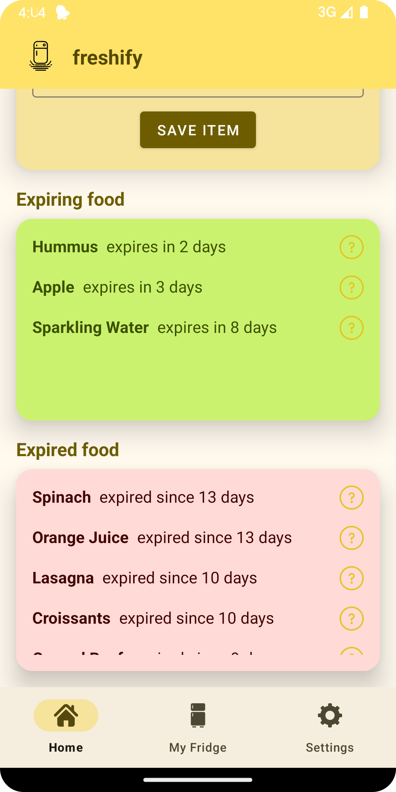
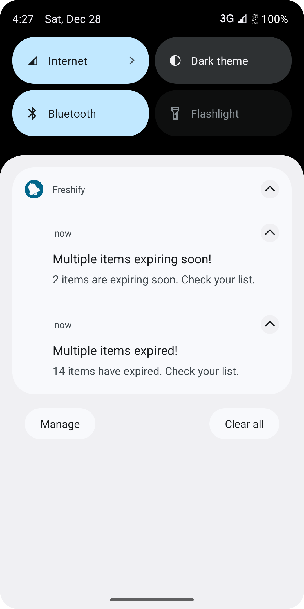

# Freshify

Freshify is a native Android application designed to help users efficiently manage their fridge contents. With features like expiration date reminders, item categorization, and multilingual support, Freshify offers a practical and user-friendly solution for keeping groceries organized.

---

## 📱 Features

### 1. **Home Tab**
The Home Tab provides a centralized overview and entry point for managing your fridge items with three card views:

1. **Add New Items**:
    - **Item Name**: Enter the name of the item.
    - **Quantity**: Specify the quantity.
    - **Category**: Choose from a dropdown menu (e.g., vegetables, dairy).
    - **Expiration Date**: Add the expiration date or use the **Web Search button** to automatically Google expiration dates.
    - **Comment Field**: Add optional notes about the item.
    - **Save Item Button**: Save the item to your fridge.

2. **Expiring Items**:
    - Displays items that will expire soon based on the configured **"Days to show expiring items"** setting.

3. **Expired Items**:
    - Lists items that have already expired.

### 2. **My Fridge Tab**
The My Fridge Tab allows for efficient organization and searching of your stored items:
- **Search Bar**: Quickly search for specific items in your fridge.
- **ChipGroups**: Filter items by categories like vegetables, fruits, dairy, etc.
- **Item List**: Displays all items with their details.

### 3. **Settings Tab**
The Settings Tab provides options to customize and manage the app:
1. **Days to Show Expiring Items**:
    - Adjust the number of days items are considered "about to expire."
    - Changes are saved in **SharedPreferences**.
2. **Manage Notification Permissions**:
    - An icon button directs users to the app's settings to manage or grant notification permissions.

---

## 🛠️ Technical Details

### 1. **UI Components**
- **BottomNavigationView**: Used for navigation between tabs (Home, My Fridge, Settings) with **Fragments**.
- **Google Components**: e.g. `TextInputEditText` for modern input fields.
- **ChipGroups**: Used in the My Fridge tab for filtering items.

### 2. **Data Storage**
- **SQLite Database**: Stores all fridge items persistently.
- **SharedPreferences**:
    - Saves entered data in the Add Item card view to resume later.
    - Stores the user’s preferred "Days to Show Expiring Items" setting.

### 3. **Notifications**
- Utilizes **WorkManager** to schedule notifications:
    - Alerts for expiring and expired items.
    - every day
- Permission flow:
    - Prompts the user to grant notification permissions.
    - Allows access to app settings for managing permissions.

### 4. **Background Operations**
- **Runnables**: Optimizes performance by running tasks like database access in the background.
- **WorkManager**: Schedules notifications efficiently.

### 5. **Interactive Features**
- `ACTION_VIEW` Intent: Opens the browser to Google expiration dates when the Web Search button is clicked.

### 6. **Theme and Language**
- **Dark/Light Mode**: Automatically adjusts to the system theme, with a manual toggle available.
- **Multilingual Support**: Automatically adapts to the system language (English or German).

---

## 📸 Screenshots

### 🏠 Home Tab
- **Add New Items**:

  

- **Expiring and Expired Items**:

  

### 🥗 My Fridge Tab

### ⚙️ Settings Tab

### 🌙 Dark Mode

### 📲 Notifications

---

## 🚀 How to Use Freshify

1. **Add Items**:
    - Use the Home tab's "Add New Items" card to input item details.
    - Click **Save Item** to add it to your fridge.

2. **Check Expiring and Expired Items**:
    - View expiring and expired items directly in the Home tab.

3. **Organize Your Fridge**:
    - Navigate to the My Fridge tab to search and filter items by category.

4. **Customize Settings**:
    - Go to the Settings tab to adjust the "Days to Show Expiring Items" or manage notification permissions.

5. **Receive Notifications**:
    - Allow permissions when prompted to receive alerts for expiring or expired items.

6. **Use Web Search**:
    - Click the **Web Search button** in the Add New Items card to find expiration dates online.

7. **Details View**:
   - Click the question mark icon to view all details about the item.

